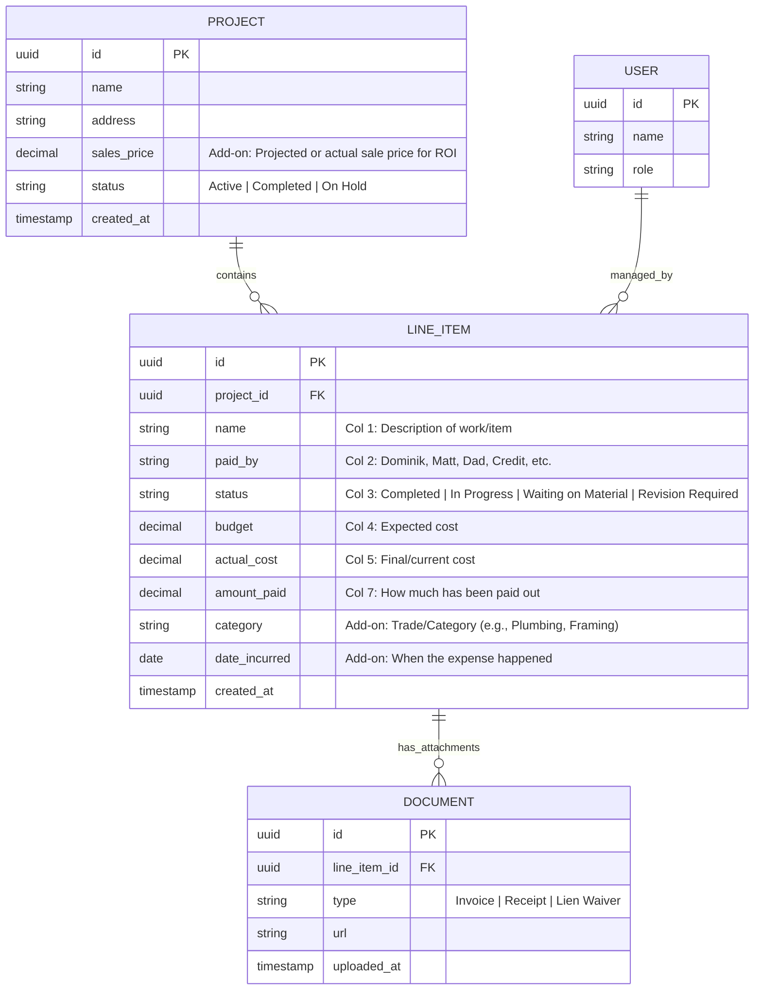

# Data Model & Storage Strategy: Expense Portal

This document outlines the proposed entity relationships and storage strategy for the Expense Approval Portal.

## 1. Storage Architecture
- **Database**: PostgreSQL (Recommended via **Supabase** or **Neon** for easy partner access/management).
- **ORM**: **Drizzle ORM** (TypeScript-first mapping for maximum type safety and performance).
- **File Storage**: Supabase Storage or AWS S3 (for Document PDF/Receipts).

---

## 2. Entity Relationship Diagram (ERD)

---

## 3. Key Data Handling Patterns

### A. The "Line Item" Core
Based on your requirements, the `LINE_ITEM` table is the heart of the application. 

### B. Derived/Calculated Fields (Variance & Amount Due)
Best practice dictates we do *not* store calculated fields directly in the database to avoid data mismatch. Instead, Drizzle ORM and PostgreSQL will calculate these on-the-fly when we query the data:
- **Col 6: Variance** = `budget` - `actual_cost` 
  *(Positive = under budget, Negative = over budget)*
- **Col 8: Amount Due** = `actual_cost` - `amount_paid`

### C. Suggested Additions to the Model
To make this portal truly powerful for construction management, I recommend adding:
1. **Category/Trade**: Grouping line items by "Plumbing", "Electrical", or "Permits". This enables the charts on the Executive Overview to show where the money went.
2. **Documents (Receipts/Lien Waivers)**: A separate table linked to the Line Item so you can upload a photo of the receipt or a PDF of a lien waiver directly to the expense.
3. **Date Incurred**: To track spending over time (useful for the Spending Velocity chart).

### D. Authentication & Enums
- **Auth**: Kept simple. We'll implement a straightforward mock/local auth initially to switch between users (Dominik, Matt, etc.).
- **Paid By**: Since you want a "custom value" option, we will store this as a standard `String` rather than a strict enum. We can provide a dropdown in the UI with the defaults (Dominik, Matt, Dad, Credit) while allowing custom text input.
- **Status**: Kept as a strict Postgres Enum (`Completed`, `In Progress`, `Waiting on Material`, `Revision Required`) to ensure data consistency for filtering.

---

## 4. Proposed Next Steps
1. **User Approval**: Confirm if Supabase/Postgres + Drizzle aligns with your infrastructure preference.
2. **Schema Implementation**: Create `src/db/schema.ts` with Drizzle definitions.
3. **Seed Data**: Generate a script to replace existing static arrays with a local development database.

> [!TIP]
> Since this is an internal tool for partners, using Supabase would also handle **Authentication** (Admin/Partner roles) and **Real-time** updates to the "Critical Alerts" feed out-of-the-box.
